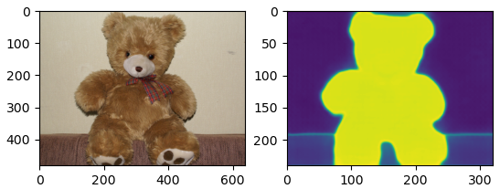

# Minimal LSeg impl in PyTorch

This is a minimal version of the dense (per-pixel) CLIP feature extractor proposed in [Language-driven semantic segmentation](https://openreview.net/forum?id=RriDjddCLN) at ICLR 2022.

**Note:** I am not an author on the paper. I merely took their [original implementation](https://github.com/isl-org/lang-seg) and extracted the core components therein.

## Install requirements

### Install pytorch

First, install a recent pytorch release by following instructions on [https://pytorch.org/](https://pytorch.org/)

### Install OpenAI CLIP

Now, install the OpenAI CLIP package by running
```bash
pip install git+https://github.com/openai/CLIP.git
```

### Build package

Build the `lseg` package by running

```bash
python setup.py build develop
```

## Try it out (examples)

### Download pretrained weights

Download the weights of the pretrained model from [this OneDrive link](https://mitprod-my.sharepoint.com/:u:/g/personal/jkrishna_mit_edu/EVlP4Ggf3OlMgDACHNVYuIYBZ4JNi5nJCQA1kXM-_nrB3w?e=XnPT39).

Copy this over to the `examples/checkpoints` directory.

Note: Source images used in the examples are from [Wikimidea](https://commons.wikimedia.org/wiki/File:Teddy_bear.jpg) and the [original LSeg repo](https://github.com/isl-org/lang-seg/blob/main/inputs/cat1.jpeg).

### Example 1: extract_lseg_features.py

```bash
cd examples
python extract_lseg_features.py
```

Commandline options supported

```
usage: extract_lseg_features.py [-h] [--checkpoint-path STR|PATH]
                                [--backbone STR] [--num-features INT]
                                [--arch-option INT] [--block-depth INT]
                                [--activation STR] [--crop-size INT]
                                [--query-image STR|PATH] [--prompt STR]
╭─ arguments ────────────────────────────────────────────────────────────────╮
│ -h, --help              show this help message and exit                    │
│ --checkpoint-path STR|PATH                                                 │
│                         (default:                                          │
│                         lseg-minimal/examples/checkpoi…                    │
│ --backbone STR          (default: clip_vitl16_384)                         │
│ --num-features INT      (default: 256)                                     │
│ --arch-option INT       (default: 0)                                       │
│ --block-depth INT       (default: 0)                                       │
│ --activation STR        (default: lrelu)                                   │
│ --crop-size INT         (default: 480)                                     │
│ --query-image STR|PATH  (default:                                          │
│                         lseg-minimal/images/teddybear.…                    │
│ --prompt STR            (default: teddy)                                   │
╰────────────────────────────────────────────────────────────────────────────╯
```

This script should produce an output that looks like:



### Example 2: lseg_openset_seg.py

This example loads an image, takes an arbitrary set of class labels specified as *comma separated text WITHOUT ANY WHITE SPACES*, and performs open-set segmentation.

```bash
cd examples
python lseg_openset_seg.py
```

Commandline options supported
```
usage: lseg_openset_seg.py [-h] [--checkpoint-path STR|PATH] [--backbone STR]
                           [--num-features INT] [--arch-option INT]
                           [--block-depth INT] [--activation STR]
                           [--crop-size INT] [--query-image STR|PATH]
                           [--segclasses STR]

╭─ arguments ────────────────────────────────────────────────────────────────╮
│ -h, --help              show this help message and exit                    │
│ --checkpoint-path STR|PATH                                                 │
│                         (default:                                          │
│                         lseg-minimal/examples/checkpoi…                    │
│ --backbone STR          (default: clip_vitl16_384)                         │
│ --num-features INT      (default: 256)                                     │
│ --arch-option INT       (default: 0)                                       │
│ --block-depth INT       (default: 0)                                       │
│ --activation STR        (default: lrelu)                                   │
│ --crop-size INT         (default: 480)                                     │
│ --query-image STR|PATH  (default:                                          │
│                         lseg-minimal/images/cat.jpg)                       │
│ --segclasses STR        (default: plant,grass,cat,stone)                   │
╰────────────────────────────────────────────────────────────────────────────╯
```

When run with the default options, this should produce the following image

